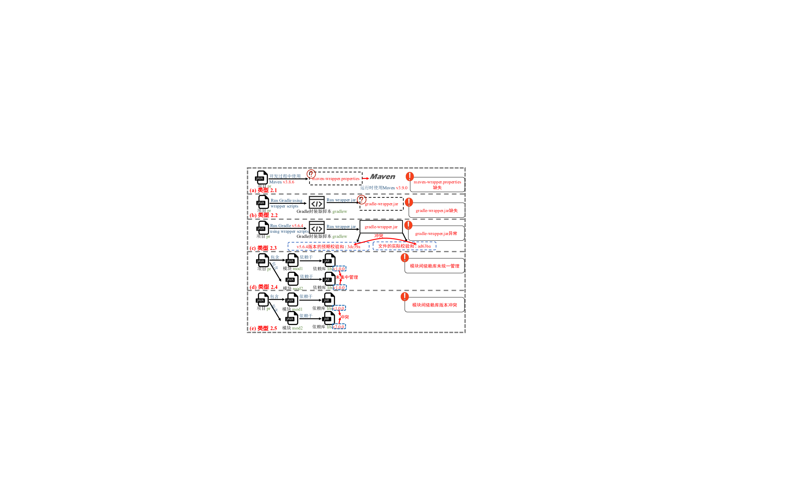
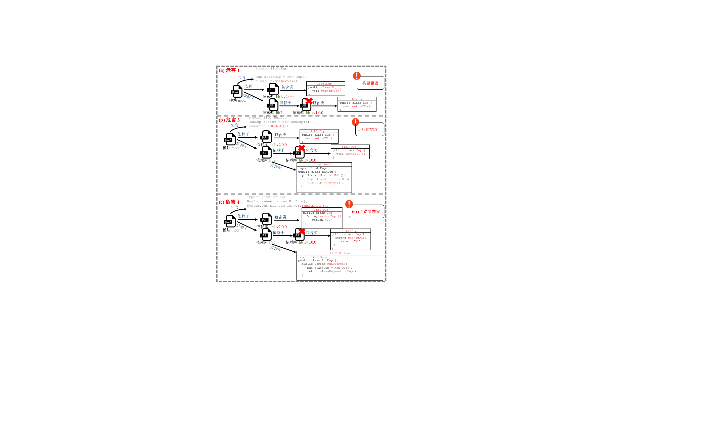
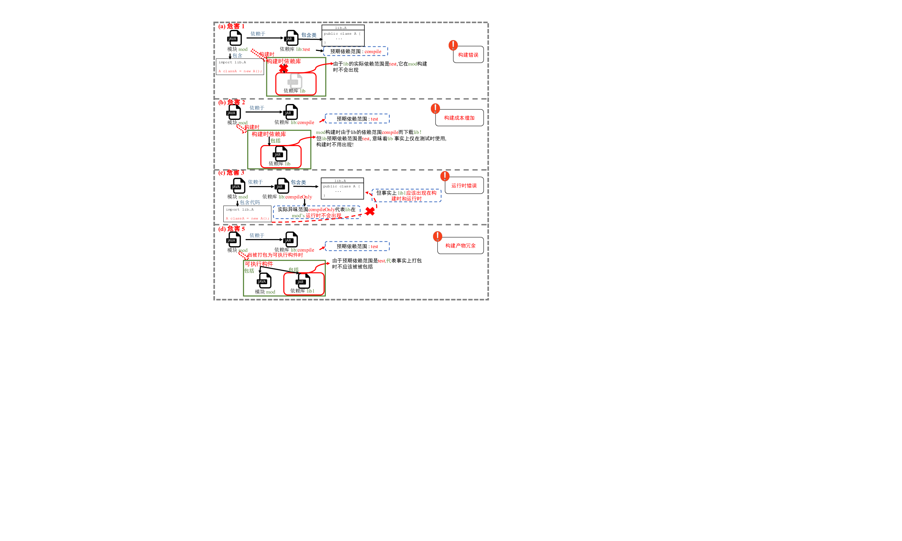
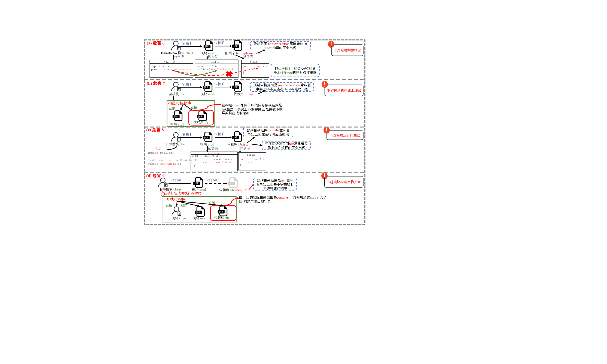
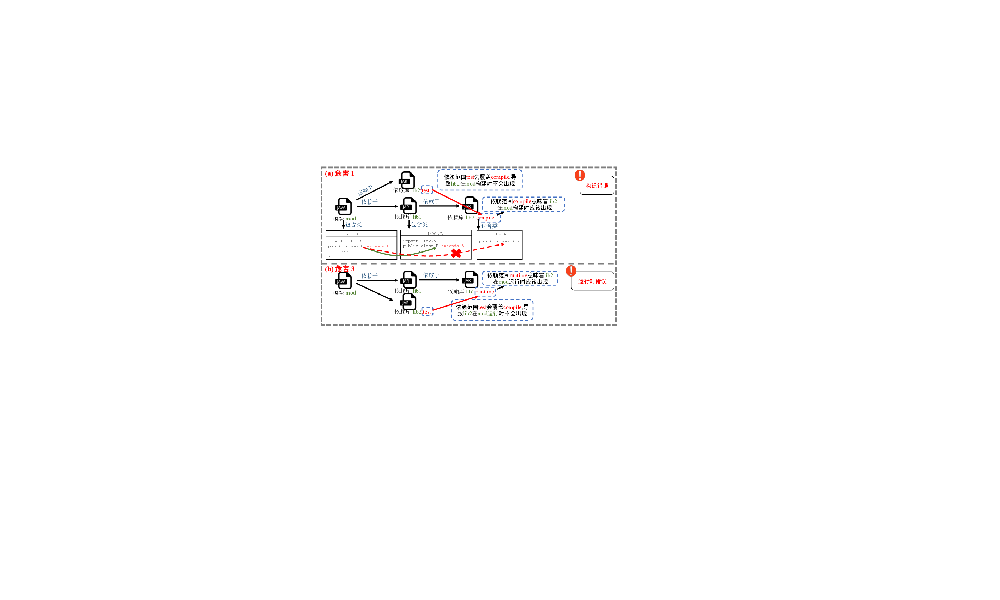
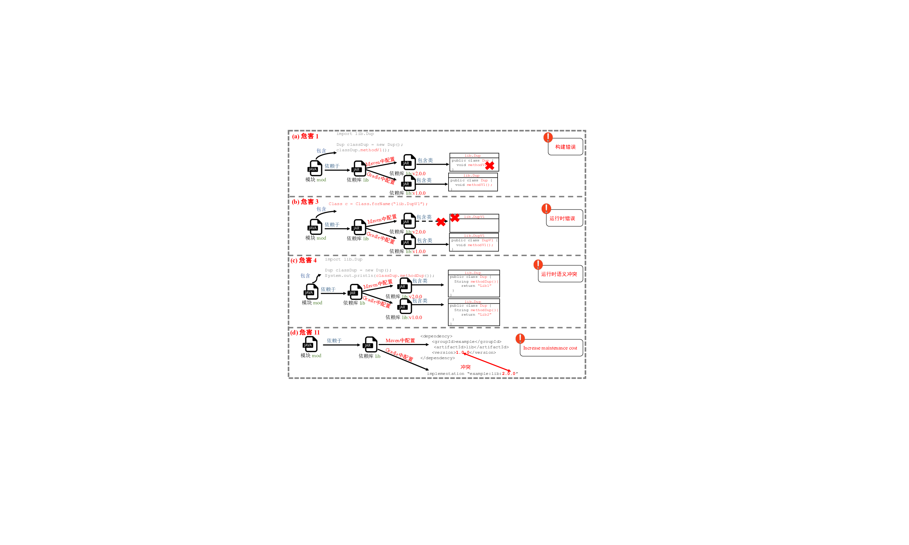
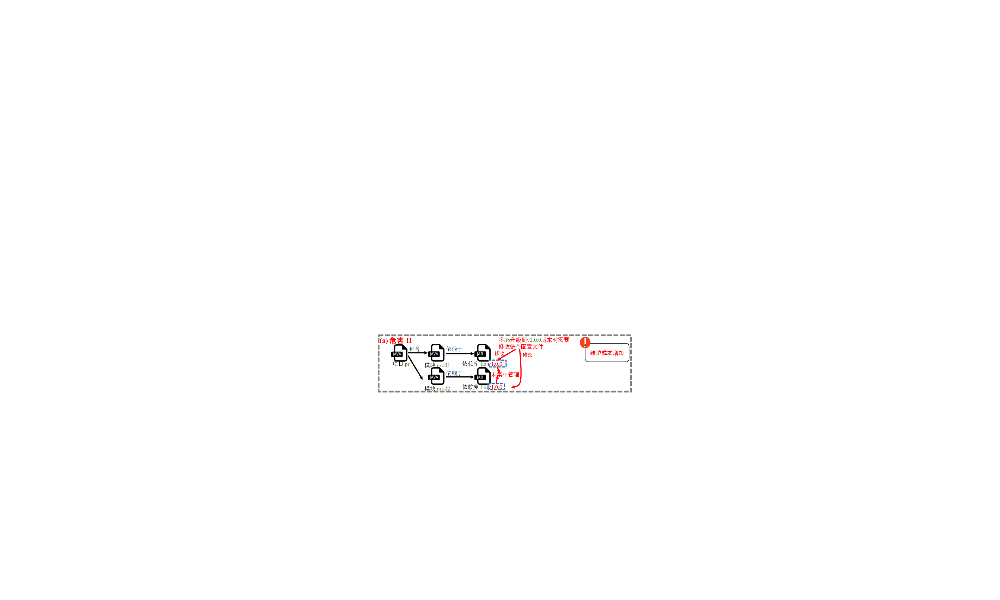

# 附录

在本附录中，我们将继续探讨Java项目中的依赖异味，描述正文中未涉及异味的特征以及可能危害与触发场景。通过实证研究，我们确定了13类依赖异味，而正文已经涵盖了其中5类异味的特征以及3类异味的部分危害与相应触发场景。接下来，我们将详细介绍剩余未涉及的异味。

## 依赖异味分类与特征

在正文中，我们已经介绍了异味1.6、1.7、1.8、2.2和2.3的特征，下文将继续介绍剩余的异味。

### 1. 模块粒度

#### 类别1.1 内外类名冲突:模块与依赖库中包含完全限定名相同的类(2/47)

模块源代码中实现的类与模块所使用的某依赖库中的类名相同。在图1(a)对应的#GJS-8中，模块gigya-java-sdk中声明类org.json.JSONObject，而这个类同样在其依赖库json中存在，从而导致模块与依赖库json中包含了完全限定名相同的类。这导致用户在试图使用与gigya-java-sdk中版本不同的的JSONObject时出现NoSuchMethodError，最终gigya-java-sdk中移除了冲突的类。

这类异味在Maven和Gradle中皆存在，产生原因主要是Java虚拟机（JVM）在提供的路径中发现多个同名类时，只会加载其中一个，并忽略其他的类。这类异味往往不易被察觉，尤其在构建可执行Jar包时，由于配置文件未将当前模块自身声明为依赖库，当遇到冲突类时，Maven和Gradle会优先选择依赖库中的类进行打包，而忽略当前模块中声明的类。

*Examples of characteristics of Module-Level Dependency Smell.*
*图1*

#### 类别1.2 外部类名冲突:模块的依赖库之间包含完全限定名相同的类(7/47)

在图1(b)对应的#IJA-127中，模块引用直接依赖imgui-java-app和被其引入的传递依赖imgui-java-binding，但imgui-java-app在打包时将一系列imgui-java-binding中的类也包含在其中，导致两个依赖库之间出现了完全限定名相同的类，最终开发者移除了imgui-java-binding中的类解决了类冲突。

这类异味在Maven和Gradle中皆存在，产生原因和异味1.1相似。不同之处在于，这种异味涉及依赖库之间的冲突，而不是模块与依赖库之间的冲突，因此不会出现因为冲突类在模块中而被忽略的情况。在这种情况下，Maven和Gradle项目都倾向于选择依赖树前序遍历序列中靠前的依赖库中的类。

#### 类别1.3 库版本冲突：依赖树中存在同一依赖库的不同版本(7/47)

在图1(c)对应的#SELENIDE-1652中，模块的直接依赖browsermob-core和selenide都引入了netty-all作为传递依赖，但netty-all的版本不同，最终只有一个版本的netty-all被选择，其余会被忽略，最终导致NoSuchMethodError。最终开发者移除了直接依赖browsermob-core解决了版本冲突。

这类异味在Maven和Gradle中皆存在，产生原因主要在于依赖管理工具的版本调停机制。当依赖树中存在同一依赖库的不同版本时，最终只有一个版本的依赖库会被选择。然而，在Maven和Gradle下，这类异味有不同的表现形式，因为它们有着不同的版本调停机制。在出现版本冲突时，Maven会选择依赖树中离模块（也就是树根）最近的依赖库；而Gradle会选择较高版本的依赖库。#SCG-79为例，模块的依赖树中同时存在google-auth-library-credentials:0.4.0和google-auth-library-credentials:0.7.0。此时，Maven选择版本0.4.0，而Gradle选择版本0.7.0。由于模块中实际使用的是0.7.0版本，引用了0.4.0版本中不存在的类ServiceAccountSigner，因此依赖管理工具若为Maven则会出现ClassNotFoundException，若为Gradle则不会。

#### 类别1.4 未声明依赖：模块直接使用了未在配置文件中声明的依赖库(6/47)

模块中存在直接使用的依赖库，然而这些依赖库并未在项目的配置文件中得到明确声明。在图1(d)对应的#EL-1849中，模块使用了依赖库asm但未在自身的配置文件中声明，但直接依赖moxy引入了asm作为其传递依赖，从而让模块能够正常访问asm中的类以进行构建和运行。最终开发者将asm声明为直接依赖，解决了依赖库未声明的情况。

这类异味在Maven和Gradle中皆存在，产生原因在于未声明的依赖库同时作为传递依赖存在，这使得在模块构建或者运行时并不会直接报告缺少声明的依赖库。这种情况下，开发者会误以为依赖库已经被正确地声明了，因为模块能够正常工作。

#### 类别1.5 未使用依赖：异味的主要特征为模块在构建文件中声明的依赖库实际上并未被使用(6/47)

在图1(e)对应的#HFJS-581中，项目在构建文件中声明了依赖库javax-samples，但实际上并未引用其中类。最终开发者在配置文件中移除了依赖库javax-samples。

这类异味在Maven和Gradle中皆存在，产生原因主要是Maven和Gradle只会在无法找到对应依赖库时报错，而不会在出现冗余依赖库时报错。这意味着当模块中存在未被使用的依赖库时，构建工具并不会发出警告或报错信息。因此，开发者很容易忽视这些未使用的依赖库，错误地认为它们是模块所需的一部分。

### 2. 项目粒度

*Examples of characteristics of Project-Level Dependency Smell.*
*图2*

#### 类别2.1 构建工具配置缺失:项qq目中缺少对其所使用构建工具的配置

在图2(a)对应的#PK-441中，项目中缺少了对Maven必要的文件如maven-wrapper.properties，导致无法准确确定使用的 Maven 版本。最终这种不一致性导致了开发环境与持续集成（CI）中 Maven 版本的不匹配，进而导致项目输出的不一致。

这类异味在Maven和Gradle中皆存在，其产生原因是主要是项目开发者未对项目构建工具启动器进行配置。然而，相较于Gradle，在Maven中这类问题更容易出现。这主要是因为Gradle的启动器概念早在其诞生之初就已经存在，而且官方文档和教程一直都在强调使用启动器的重要性。此外，在创建新项目时，Gradle会自动添加启动器配置，进一步推广了其使用。相反，Maven是在借鉴了Gradle后才添加了启动器功能，这导致了相对于Gradle项目，Maven项目中配置缺失的情况更为普遍。

#### 类别2.4 模块间库重复:这类异味的主要特征是项目模块间包含未进行统一管理的相同依赖库

在图2(d)对应的#STARGATE-235中，stargate在不同的模块中有一系列相同的依赖库，如jetty-servlet等，但他们的版本声明都分散在各自模块的配置文件中，而没有利用Maven提供的dependencyManagement功能在项目中进行统一管理。最终开发者取消了各模块中分散的版本声明，而是统一进行管理。

这类异味在 Maven 和 Gradle 中皆存在，其产生原因主要是开发者对Maven和Gradle提供统一依赖管理机制的忽略，它们都提供了相关机制来集中管理项目中的依赖版本，以确保在不同模块中使用相同的库版本。

#### 类别2.5 模块间库冲突:这类异味的主要特征为项目多个模块中使用了不同版本的同一依赖库

在图2(e)对应的#PULSAR-2642中，项目pulsar的模块pulsar-client和模块pulsar-client-schema中分别使用了protobuf的2.0和3.0版本。由于protobuf:3.0相较于2.0版本能力更强，pular计划最终将所有模块中protobuf版本升级为3.0，但目前尚未完成这一过程，最终导致模块之间出现依赖库的版本冲突。

这类异味在 Maven 和 Gradle 中皆存在，其主要有两种产生原因。首先，项目可能考虑到旧版本依赖库兼容性的考虑或者正处于依赖库的升级过程中，从而被迫在不同模块中使用不同版本的依赖库，上例即对应这类产生原因。其次，另一种产生原因是由于项目中出现了依赖库分散管理的情况（即异味2.4），从而对单一模块依赖库版本的修改未同步到其他模块，进而引发模块间的依赖库版本冲突问题。

---

## 依赖异味危害与触发场景

在正文中，我们已经介绍了异味1.4、1.6和1.7的部分危害与对应触发场景。下文将继续介绍剩余异味的可能危害以及异味1.4、1.6和1.7未在正文中被介绍的危害，并介绍这些危害对应的触发场景。

## A. 模块粒度## 

*Possible Hazards and Triggering Scenarios of Smell 1.1.*
*图1.1*

*Possible Hazards and Triggering Scenarios of Smell 1.2.*
*图1.2*

#### (1.1)内外类冲突

内外类冲突可能引发一系列严重的后果，包括但不限于模块构建失败、运行时错误以及运行时语义冲突。以下将详细阐述这些危害的具体触发场景。

a. 构建失败:其触发场景为模块源码中调用了依赖库中同名冲突类独有的方法。以图1.1(a)为例，模块mod和依赖库lib中均存在名为Dup的冲突类，但方法methodLib仅在lib中的Dup类中定义。若模块mod试图调用该方法时，由于该方法在模块自身的Dup类中不存在，会导致构建失败。

b. 运行时错误：其触发场景为模块运行时调用了依赖库中同名冲突类独有的方法。以图1.1(b)为例，与上例类似，模块mod和依赖库lib中同样存在冲突类Dup，并且方法methodLib同样仅在lib中的Dup中存在。但此时mod并未直接调用methodLib，而是调用了RunDup中的runMethodLib方法，间接调用了methodLib。此时虽然模块能正常构建，但在运行时则无法找到对应方法，进而造成运行时错误。

c. 运行时语义冲突：其触发场景为模块运行时调用了冲突类中签名相同但实现不同的方法。以图1.1(c)为例，模块mod和依赖库lib中存在冲突类Dup和同签名方法methodLib，但其具体实现不同。当mod调用methodLib时就会出现语义冲突，预期调用的是mod中的Dup类，对应的methodDup返回"Module"，而实际调用的是Lib中的Dup类，对应的methodDup返回"Lib"。

#### (1.2)外部类冲突

外部类冲突可能引发一系列严重的后果，包括但不限于模块构建失败、运行时错误以及运行时语义冲突。以下将详细阐述这些危害的具体触发场景。

a. 构建失败：其触发场景为模块源码中调用了仅存在于被遮蔽的同名冲突类中的方法。以图1.2(a)为例，模块mod的依赖库lib1和lib2中存在冲突类Dup，mod试图调用仅存在于lib2中的方法methodLib2，但由于lib1在依赖树中与mod距离更近，最终lib2中的类Dup被忽略，导致构建失败。

b. 运行时错误：其触发场景为项目运行时调用了仅存在于被遮蔽的同名冲突类中的方法。以图1.2(b)为例，模块mod的依赖库lib1和lib2中存在冲突类Dup，mod试图调用lib2中的方法runMtdLib，其间接调用了Dup中的方法methodLib2。由于并未直接调用methodLib2，模块可以正常进行构建。但在运行时，JVM会忽略lib2中的类Dup，因此在运行时则无法找到lib对应方法，导致运行时错误。

c. 运行时语义冲突：其触发场景为模块运行时调用了冲突类中签名相同但实现不同的方法。以图1.2(c)为例，模块mod的依赖库lib1和lib2中存在冲突类Dup和同签名方法methodLib，但其具体实现不同。当mod调用methodLib时就会出现语义冲突，预期调用的是lib2中的Dup类，对应的methodDup返回"lib2"，而实际调用的是lib1中的Dup类，对应的methodDup返回"lib1"。

*Possible Hazards and Triggering Scenarios of Smell 1.3.*
*图1.3*

*Possible Hazards and Triggering Scenarios of Smell 1.4.*
*图1.4*

#### (1.3)库版本冲突

库版本冲突可能引发一系列严重的后果，包括但不限于模块构建失败、运行时错误以及运行时语义冲突。以下将详细阐述这些危害的具体触发场景。

a. 构建失败：其触发场景为模块源码中调用了仅存在于被遮蔽的库中的特性（例如方法）。以图1.3(a)为例，模块mod的依赖树中同时存在lib1的1.0.0和2.0.0版本。根据Maven和Gradle的版本冲突解决机制，最终1.0.0版本会被遮蔽，但mod在源码中试图调用仅存在于1.0.0版本中的方法methodV1，这导致模块构建失败。

b. 运行时错误：其触发场景为模块运行时调用了仅存在于被遮蔽的库中的特性。以图1.3(b)为例，模块mod直接依赖于lib1:2.0.0和lib2，lib2又依赖于lib1:1.0.0，并且在runMtdLib中调用了仅存在于lib1:1.0.0中的方法methodV1。当mod试图调用runMtdLib时，由于lib1:1.0.0被遮蔽，最终出现运行时错误。

c. 运行时语义冲突：其触发场景为模块运行时调用了被遮蔽库中签名相同但实现不同的方法。以图1.3(c)为例，模块mod的依赖树中同时存在lib1的1.0.0和2.0.0版本，两个版本的lib1中都包含签名相同的methodDup方法，但其具体实现不同。当mod调用methodDup时就会出现语义冲突，预期调用的是2.0.0版本中的methodDup，应返回"V2"，而实际调用的是1.0.0版本中的方法，返回的是"V1"。

#### (1.4)未声明依赖

未声明依赖可能引发一系列严重的后果，包括但不限于模块构建失败、运行时错误以及运行时语义冲突。以下将详细阐述这些危害的具体触发场景。

a. 构建失败：其触发场景为模块源码中使用但未声明的依赖库未在依赖树中出现。以图1.4(a)为例，模块mod中引用依赖库lib2中的类A，但并未在配置文件中声明lib2，而是通过依赖库lib1:4.0.0引入lib2作为传递依赖。然而lib1升级到4.0.1后不再依赖于lib2，mod的依赖树中不再存在lib2，无法找到对应类，导致构建失败。

b. 运行时错误：其触发场景为模块运行时使用但未声明的依赖库未在依赖树中出现。以图1.4(b)为例，mod利用反射特性引用依赖库lib2中的类A，但并未在配置文件中声明。和上例类似，在mod依赖树中不再存在lib2后，由于mod并未在源码中引入类A，而是利用反射特性，所以mod不会出现构建失败，但在运行时则会因为无法找到类A而出现运行时错误。

c. 运行时语义冲突：其触发场景为模块直接使用但未声明的依赖库版本升级后出现签名相同但实现不同的情况。以图1.4(c)为例，模块mod中直接使用lib2:1.0.0中的方法getVersion，但并未在配置文件中声明lib2，而是通过依赖库lib1:4.0.0引入lib2:1.0.0作为传递依赖。然而lib1升级到4.0.1时同时升级lib2版本，引入传递依赖lib2:2.0.0，其中方法getVersion的签名并未改变，但其具体实现不同。当mod调用version时就会出现语义冲突，预期调用的是1.0.0版本中的getVersion，应返回"V1"，而实际调用的是2.0.0版本中的方法，返回的是"V2"。

*Possible Hazards and Triggering Scenarios of Smell 1.5.*
*图1.5*

*Possible Hazards to Current Module and Triggering Scenarios of Smell 1.6.*
*图1.6.1*

#### (1.5)未使用依赖

未使用依赖不会如前述异味一般造成构建失败等破坏性的危害，但会造成构建成本增加、构建产物冗余等危害。以下将详细阐述这些危害的具体触发场景。

a. 构建成本增加：这类危害在出现依赖未使用时始终存在。以图1.5(a)为例，模块mod并未使用依赖库lib中的特性，但却在配置文件中进行声明，导致在构建时该依赖会被引入，需要从中央存储仓库获取对应依赖库，进而导致构建时间增加，即增加构建成本。

b. 构建产物冗余：其触发场景为模块可执行JAR的打包。以图1.5(b)为例，模块mod并未使用依赖库lib中的特性，但却在配置文件中进行声明。而Maven和Gradle在将mod打包为可执行JAR时，所有的依赖库都会被涵盖，包括实际上并未被使用的lib，导致构建产物冗余。

c. 下游模块构建成本增加：这类危害在出现依赖未使用时始终存在。以图1.5(c)为例，模块mod并未使用依赖库lib中的特性，但却在配置文件中进行声明。下游模块client在使用模块mod的同时，也就引入了mod的依赖库lib作为传递依赖，其会在构建时被引入，需要从中央存储仓库获取对应依赖库，进而导致构建时间增加，即增加下游模块client的构建成本。

d. 下游模块构建产物冗余：其触发场景为下游模块可执行JAR的打包。以图1.5(d)为例，模块mod并未使用依赖库lib中的特性，但却在配置文件中进行声明。下游模块client在使用模块mod的同时，也引入了mod的依赖库lib作为传递依赖，而Maven和Gradle在将client打包为可执行JAR时，所有直接依赖和传递依赖库都会被包括，导致下游模块lib构建产物冗余。

#### (1.6)依赖范围误用

Maven和Gradle有多个不同的依赖范围，而不同依赖范围之间的误用造成的危害也不尽相同。因此，此类异味有大量触发场景和对应的危害。我们分别选取Maven和Gradle中主要的依赖范围，将不同依赖范围之间误用所对应的危害列于表中，其中表行代表依赖库的预期依赖范围，表列代表实际依赖范围，表的内容代表可能的危害，其对应触发场景即为所在行和列对应依赖范围的误用。

a. 构建失败：以预期依赖范围为compile，实际范围为test为例，在图1.6.1(a)中，模块mod在源码中直接引用lib中的类A，因此其预期依赖范围应该是compile，但其实际依赖范围被设置为test，代表其只会在测试时出现而不会在构建时出现，这就导致mod构建时无法找到类A，最终构建失败。

b. 构建成本增加：以预期范围为test，实际范围为compile为例，在图1.6.1(b)中，模块mod将直接依赖lib的依赖范围设置为compile，代表其在构建、运行和测试时都被使用，但其预期依赖范围是test，代表其不应该在构建时出现。因此在mod进行构建时，需要从中央存储仓库获取事实上不必要的lib，导致构建时间增加，即增加构建成本。

d. 构建产物冗余：以预期范围为test，实际范围为compile为例，在图1.6.1(d)中，模块mod将直接依赖lib的依赖范围设置为compile，但其实际上仅在测试时被使用，预期依赖范围应为test。在mod打包为可执行JAR时，所有依赖范围为compile的依赖库都会被涵盖，而会忽略依赖范围为test的依赖库，这就导致lib被错误地包括进构建产物中，最终导致构建产物冗余。

f. 下游模块构建成本增加：以预期依赖范围为implementation，实际范围为api为例，在图1.6.2(b)中，模块mod将依赖库lib的依赖范围设置为api，此范围意味着被下游模块client在构建时引入mod就也会同时引入lib，但lib仅用于mod内部实现，其预期范围是implementation，不应该出现在client的构建时。因此client在构建时需要从中央存储仓库获取事实上不必要的lib，导致构建时间增加，即增加构建成本。

g. 下游模块运行时错误：以预期依赖范围为runtime，实际范围为test为例，在图1.6.2(c)中，模块mod将依赖库lib的依赖范围设置为test，此范围意味着test不会在运行时被引入，但事实上mod中的方法runMtdLib以反射形式获取lib中的类lib.A，其预期范围应该是runtime。由于lib.A以反射形式被引入，此时mod可以正常进行构建，但当下游项目运行时使用runMthdLib时，则会因为lib未在运行时被引入，无法找到lib.A，从而导致下游模块运行时错误。

h. 下游模块构建产物冗余：以预期范围为test，实际范围为compile为例，在图1.6.2(d)中，模块mod将直接依赖lib的依赖范围设置为compile，但其实际上仅在测试时被使用，预期依赖范围应为test。下游模块client在使用模块mod的同时，也引入了mod的依赖库lib作为传递依赖。将client打包为可执行JAR时，直接依赖和传递依赖中依赖范围为compile的依赖库都会被包含，但事实上lib仅在测试时使用而不需被打包，这就导致导致下游模块lib构建产物冗余。

*Possible Hazards to Downstream Module and Triggering Scenarios of Smell 1.6.*
*图1.6.2*

#### (1.7)依赖范围冲突

依赖范围冲突与异味1.6依赖范围误用类似，不同依赖范围之间的冲突可能造成不同的危害。我们将最终结果展示在表中，其中表列代表直接依赖的依赖范围，表行代表被覆盖的传递依赖的依赖范围，表的内容是对应依赖范围出现冲突时的后果。与依赖范围误用不同，依赖范围冲突不会对下游模块造成危害，因为Maven中的漏洞仅会影响项目自身依赖解析。此外，从表格的右上部分可以看出，当直接依赖的使用场景包含了传递依赖的使用场景时也不会造成危害。下面我们将详述各类危害的具体触发情境。

a. 构建失败：其触发场景为直接依赖的runtime和test范围覆盖了传递依赖的compile和provided范围。以图1.7(a)为例，模块mod有直接依赖lib1和lib2，而lib1也引入lib2作为传递依赖。在mod的依赖树中，lib2作为直接依赖的范围是test，而作为传递依赖的范围是compile。此时，lib2的最终范围是test，仅会在测试时出现。但在mod中虽然并未直接引入lib2中的类，但其中的类C以lib2中的类A为父类，这就导致mod构建时无法找到类A，进而出现构建失败。

*Possible Hazards and Triggering Scenarios of Smell 1.7.*
*图1.7*

#### (1.8)依赖树冲突

依赖树冲突的危害与异味1.3类似，其差别在于异味1.3关注于单一依赖树中的库版本冲突，而异味1.8则关注于Maven和Gradle之间依赖树的冲突，下面我们将详述各类危害的具体触发情境.

a. 构建失败：其触发场景为模块源码中调用了某冲突依赖库中独有的特性。以图1.8(a)为例，模块mod同时维护了Maven和Gradle对应的配置文件，但依赖库lib在Maven配置文件中的版本声明为2.0.0，而在Gradle配置文件中则为1.0.0。由于mod在源码中调用了仅存在于1.0.0版本中的方法methodV1，试图使用Maven进行构建时无法找到对应方法，因此出现构建失败。

b. 运行时错误：其触发场景为模块运行时调用了某冲突依赖库中独有的特性。以图1.8(c)为例，与上例类似，mod在Maven中依赖于lib:1.0.0而在Gradle中依赖于lib:2.0.0。此时mod以反射形式获取仅存在于1.0.0版本中的类lib.DupV1，能正常通过构建，但在运行Maven对应构建产物时，会因找不到lib.DupV1而出现运行时错误。

c. 运行时语义冲突：其触发场景为模块运行时调用了冲突依赖库中签名相同但实现不同的方法。以图1.8(d)为例，与上例类似，mod在Maven中依赖于lib:1.0.0而在Gradle中依赖于lib:2.0.0。虽然类Dup中的方法methodDup在两个版本中都存在，但其具体实现不同。当mod试图调用methodDup时会出现语义冲突，在运行Maven构建产物时的输出为“Lib1”，而运行Gradle构建产物时输出则为"Lib2"。

d. 维护成本增加：这类危害在出现异味时始终存在。以图1.8(a)为例，模块mod同时维护了Maven和Gradle对应的配置文件，但依赖库lib在Maven配置文件中的版本为1.0.0，而在Gradle配置文件中为2.0.0。开发者在进行版本升级时需要同步更新至所有构建工具对应的配置文件，导致维护成本增加。

*Possible Hazards and Triggering Scenarios of Smell 1.8.*
*图1.8*

*Possible Hazards and Triggering Scenarios of Smell 2.1.*
*图2.1*

*Possible Hazards and Triggering Scenarios of Smell 2.2.*
*图2.2*

#### (2.1)构建工具配置缺失

构建工具配置缺失可能导致无法获取预期版本的构建工具，进而导致构建失败。

a. 构建失败：其触发场景为项目实际使用的构建工具版本与预期不一致，且使用了仅存在于预期版本中的特性。以图2.1(a)为例，项目预期使用Gradle 4.1版本并使用了4.1中新引入的java-library特性，但实际上未对Gradle版本进行配置，导致实际使用的是本地Gradle的3.1版本。因此，无法识别java-library特性，导致构建失败。

*Possible Hazards and Triggering Scenarios of Smell 2.3.*
*图2.3*

*Possible Hazards and Triggering Scenarios of Smell 2.4.*
*图2.4*

*Possible Hazards and Triggering Scenarios of Smell 2.5.*
*图2.5*

#### (2.2)构建工具启动器JAR缺失

构建工具启动器JAR缺失与异味2.1类似，同样可能导致无法获取预期版本的构建工具，进而导致构建失败。

a. 构建失败：其触发场景为项目使用构建工具启动器运行构建工具。以图2.2(a)为例，项目预期使用Gradle 4.1版本并使用了4.1中新引入的java-library特性，但本地仅存在Gradle 3.1版本而无法进行构建。在使用构建工具启动器时，由于项目中仅存在启动器脚本(gradlew)，而缺少启动器JAR(gradle-wrapper.jar)，因此无法找到gradle-wrapper.jar而导致构建失败。

#### (2.3)构建工具启动器JAR异常

构建工具启动器JAR异常可能造成构建成本增加和构建工具使用时的安全隐患，以下将详细阐述这些危害的具体触发场景。

a. 构建成本增加：其触发场景为项目构建工具启动器 JAR 版本过旧，导致性能问题。以图2.3(a)为例，项目使用的是 Gradle 3.0 版本，对应的 gradle-wrapper.jar 应该是 3.0 版本，预期的校验和为42d7a2，但实际的校验和为 695089，对应于 2.6 版本。然而，Gradle 2.6 版本存在严重的性能下降问题，影响了 Gradle 包装器的启动时间，进而导致构建成本增加，而在 3.0 版本中此问题已被修复。

b. 构建工具使用时存在安全隐患：其触发场景为项目构建工具启动器 JAR 被篡改。以图2.3(b)为例，项目中的 gradle-wrapper.jar 校验和与任何官方发布的已知版本都不相符。其被修改并添加了恶意代码，当开发者试图通过构建工具启动器启动构建工具时，可能会导致安全隐患，例如开发者的信息被窃取等。

#### (2.4)模块间库重复

模块间库重复可能会造成项目维护成本的增加，其触发场景如下。

a. 维护成本增加：其触发场景为项目对未集中管理的依赖库进行版本升级。以图2.4(a)为例，项目中的模块mod1和mod2之间存在同一依赖库lib的1.0.0版本，但其版本分别在各自配置文件中进行声明，而并未进行统一指定。在试图将lib升级至2.0.0版本时，需要将修改同步至所有模块，这就导致项目维护成本的增加。

#### (2.5)模块间库冲突

模块间库冲突的危害和模块间库重复类似，同样会增加项目维护成本，并可能增加下游项目出现依赖冲突的几率。

a. 维护成本增加：其触发场景为项目对未集中管理的依赖库进行版本升级。以图2.5(a)为例，项目中的模块mod1和mod2分别依赖于依赖库lib的1.0.0和2.0.0版本。在试图将lib升级至3.0.0版本时，需要将修改同步至所有模块，这就导致项目维护成本的增加。
